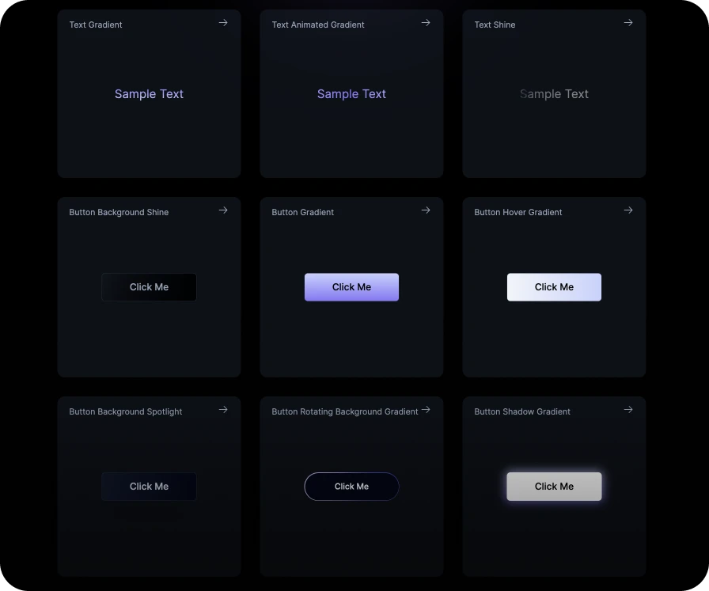

 

# Blink

Welcome to Blink, a collection of modern UI components and effects crafted with React and Tailwind CSS. This repository is a companion to my [blog](https://www.julienthibeaut.xyz/blog), where I write about various topics around design, front-end development, and more.

## How to Use

All components in this collection are designed to be easily integrated into your projects. Simply click on a component, copy the code, and paste it into your project.

## Inspiration

The components in this collection are inspired by various websites that have caught my eye, including: [Linear](https://linear.app/), [Liveblocks](https://liveblocks.io/), [Raycast](https://www.raycast.com/), [Vercel](https://vercel.com/), and more.
